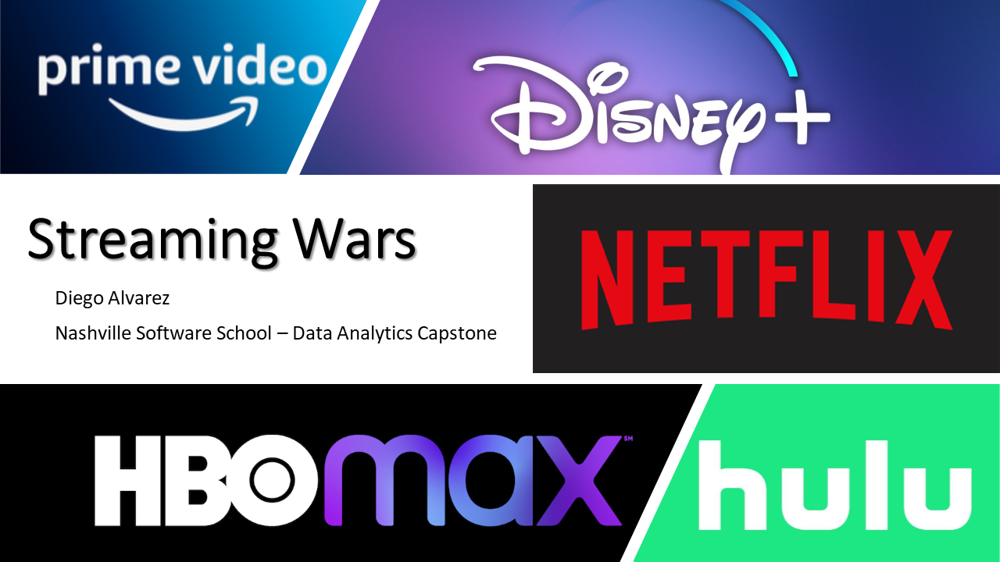

# NSS-Capstone-Streaming-Service-Comparison

Thank you for checking out my Capstone Project!

## Short Description
Scrape data and create a dashboard to help people choose the best streaming service for them

## Executive Summary
This project will create an interactive dashboard to help consumers decide which streaming service is worth subscribing to based on their viewing preferences. 

The idea is for a user to be able to filter by factors such as genre, age group, and even specific shows and movies, and see which streaming service has more shows and movies they'd be interested in seeing.  IMDB and Rotten Tomato ratings can be used to quantify quality offerings are as well. 

## Motivation
During this COVID pandemic, streaming services have been one of my main forms of entertainment. However, the area of streaming services has interested me for a while. It’s such a big example of a disruptive innovation:  gone are the days when cable companies and their bundled offerings were the only way to watch tv. This new market, subscription video on demand (SVoD) is huge today, and projected to continue growing.  

I have wondered and been asked before:  what is better…Netflix or Hulu?  Hopefully with this project, I can best answer that question for people (an answer that clearly depends on their preferences!)

## Data Question
Overall question is: what is the best streaming service for a certain person? This will vary. Some factors that could be considered:
-	Favorite genre (action, horror, etc)
-	Age group 
-	Number of offerings by the service
-	Quality of offerings by the service

## Data Sources
All data was scraped from Reelgood's website (www.reelgood.com).

*Data as of June 2020. Note that services change offerings frequently.  
*Other sources used for presentation materials, and are referenced in the last slide of the presentation.

## Dashboard
Published to Tableau Public.  
[Check it out here!](https://public.tableau.com/profile/diego.alvarez6475#!/vizhome/streaming_service_analysis_dashboard/Dashboard1?publish=yes)

